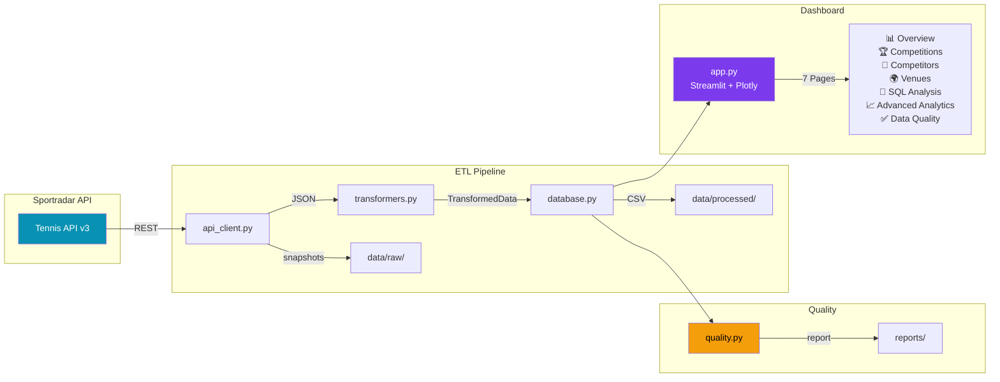

# SportRadar Tennis Analytics

[](https://www.python.org/)
[](LICENSE)
[](https://github.com/astral-sh/ruff)

A professional tennis analytics platform that ingests Sportradar tennis data, normalizes nested JSON into a relational schema, validates data quality, and presents insights through an interactive Streamlit dashboard.

---

## Architecture



## Current Data Snapshot

The local database was refreshed from the live Sportradar API on 2026-07-21.

| Table | Rows |
| --- | ---: |
| categories | 18 |
| competitions | 6,619 |
| complexes | 767 |
| venues | 4,021 |
| competitors | 1,000 |
| competitor_rankings | 1,000 |
| api_sync_log | 3 |

## Features

### Core
- 🔌 API integration for `competitions`, `complexes`, and `double_competitors_rankings`
- 🗄️ Normalized SQL schema with primary keys, foreign keys, and analytical indexes
- 🔄 Full refresh pipeline with retries, rate-limit handling, partial failure recovery
- 📸 Raw JSON snapshots and CSV exports
- 🔒 API key redaction in all log output
- ✅ 15+ automated data quality checks with composite scoring

### Dashboard (v2.0)
- 🌙 Premium dark theme with glassmorphism design
- 📈 Interactive Plotly charts (bar, scatter, pie, treemap, sunburst, choropleth)
- 📊 7-page analytics dashboard with animated gradient metric cards
- 📥 Data export (CSV/JSON) from every table and chart
- 🔍 Advanced filtering and search across all entities
- 🌐 Geographic coverage map with choropleth visualization

### DevOps
- 🧪 Comprehensive test suite (pytest + coverage)
- 🔧 CI/CD with GitHub Actions (lint, type check, test, security audit)
- 🐳 Docker support (multi-stage build, non-root user)
- 📋 Pre-commit hooks (Ruff lint + format)

## Project Structure

```text
SportRadar_Tennis_Analytics/
├── app.py                          Premium Streamlit dashboard (7 pages)
├── requirements.txt                Python dependencies
├── pyproject.toml                  Project metadata, tools config
├── Makefile                        Developer shortcuts
├── Dockerfile                      Multi-stage production build
├── docker-compose.yml              Container orchestration
├── .github/workflows/ci.yml        CI/CD pipeline
├── .pre-commit-config.yaml         Git hooks
│
├── tennis_analytics/               Core Python package
│   ├── __init__.py                 Package exports & metadata
│   ├── config.py                   Settings (frozen dataclass, .env)
│   ├── api_client.py               Sportradar API client (retry, rate-limit)
│   ├── pipeline.py                 ETL orchestration
│   ├── transformers.py             JSON → relational flattening
│   ├── database.py                 SQLAlchemy schema & persistence
│   ├── quality.py                  Automated quality checks
│   ├── queries.py                  SQL query catalog
│   ├── exceptions.py               Exception hierarchy
│   └── logging_config.py           Logging with secret redaction
│
├── scripts/
│   ├── refresh_data.py             CLI data refresh
│   └── run_quality_checks.py       CLI quality report
│
├── sql/                            Schema DDL & analysis SQL
├── tests/                          Test suite (pytest)
├── data/                           Database, raw JSON, CSV exports
├── docs/                           Documentation & reports
├── CONTRIBUTING.md                 Developer guide
├── CHANGELOG.md                    Version history
└── LICENSE                         MIT License
```

## Quick Start

### Option 1: Local Setup

```bash
# Clone and setup
python -m venv .venv
.venv\Scripts\Activate.ps1       # Windows PowerShell
pip install -r requirements.txt

# Configure API key (optional — pre-populated DB included)
Copy-Item .env.example .env
notepad .env                      # Add your SPORTRADAR_API_KEY

# Launch dashboard
python -m streamlit run app.py
```

### Option 2: Docker

```bash
docker compose up --build
# Dashboard available at http://localhost:8501
```

### Option 3: Make

```bash
make install    # Install dependencies
make run        # Launch dashboard
make test       # Run test suite
make lint       # Check code style
```

## Development

```bash
# Install dev dependencies
pip install -e ".[dev]"

# Setup pre-commit hooks
pre-commit install

# Run tests with coverage
pytest tests/ -v --cov=tennis_analytics --cov-report=term-missing

# Lint and format
ruff check . && ruff format --check .

# Type checking
mypy tennis_analytics/ --ignore-missing-imports
```

## Refresh Data

```bash
python scripts/refresh_data.py              # Full refresh
python scripts/refresh_data.py --no-raw     # Skip raw JSON snapshots
python scripts/refresh_data.py --no-csv     # Skip CSV exports
```

The API key is read from `SPORTRADAR_API_KEY` in `.env`. The database defaults to SQLite at `data/tennis_analytics.db`. Set `DATABASE_URL` for PostgreSQL or MySQL.

## SQL Deliverables

| File | Description |
| --- | --- |
| `sql/01_schema_sqlite.sql` | SQLite schema DDL |
| `sql/02_schema_postgresql.sql` | PostgreSQL schema DDL |
| `sql/03_schema_mysql.sql` | MySQL schema DDL |
| `sql/04_analysis_queries.sql` | Required analysis queries |
| `docs/sql_queries.md` | Query documentation guide |

## API References

- [Competitions](https://developer.sportradar.com/tennis/reference/competitions)
- [Complexes](https://developer.sportradar.com/tennis/reference/complexes)
- [Doubles Competitor Rankings](https://developer.sportradar.com/tennis/reference/doubles-competitor-rankings)

## License

This project is licensed under the MIT License — see [LICENSE](LICENSE) for details.
